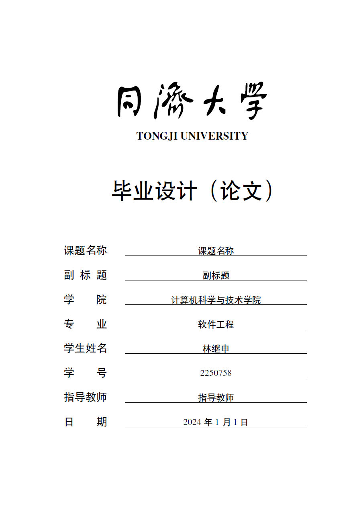
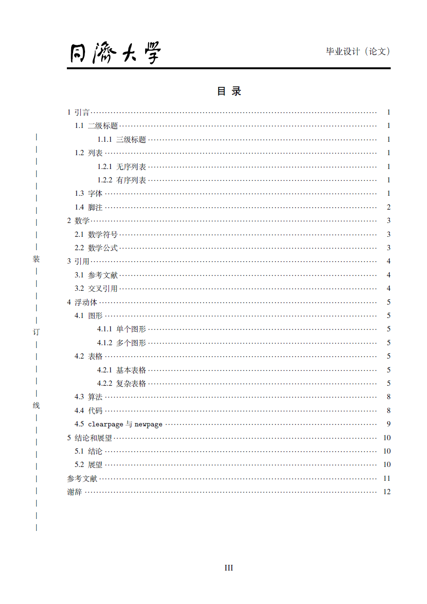
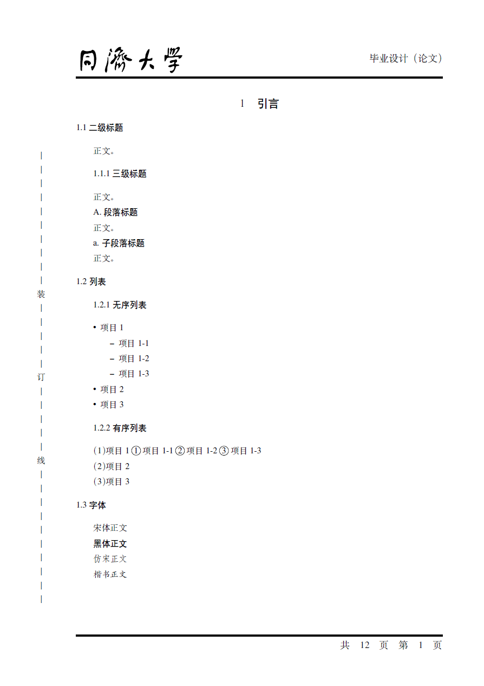
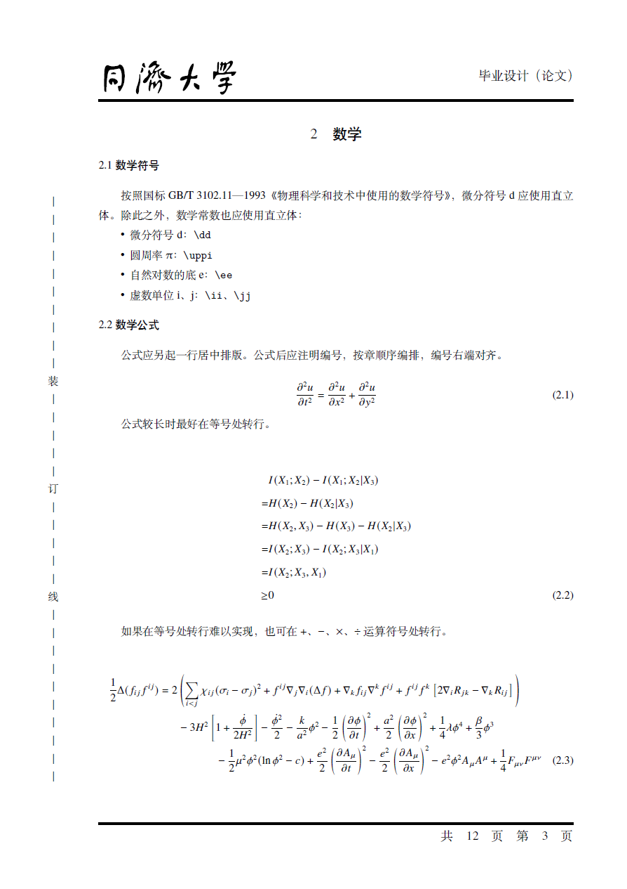
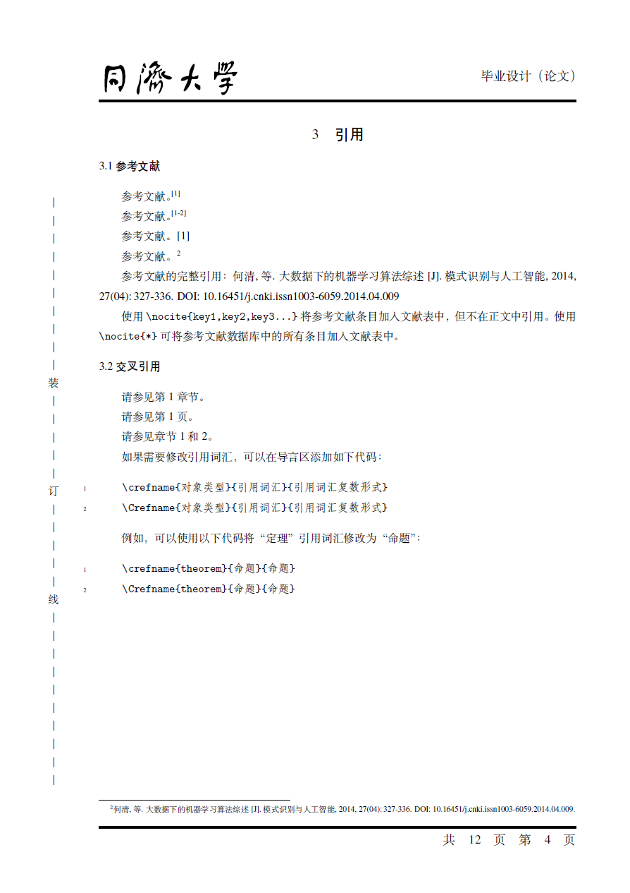
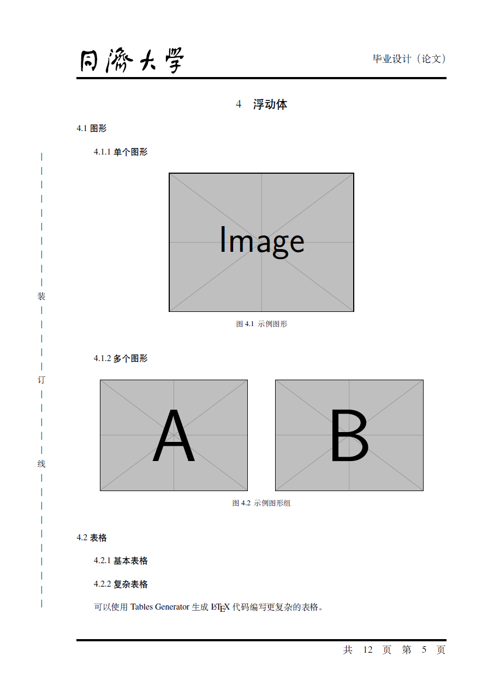
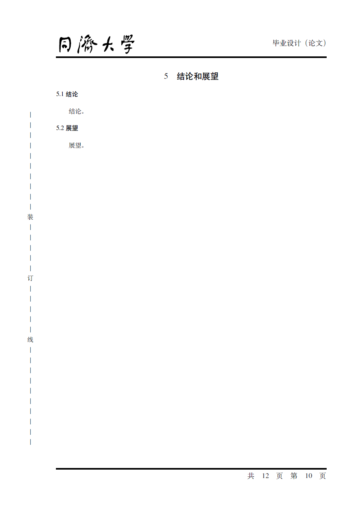
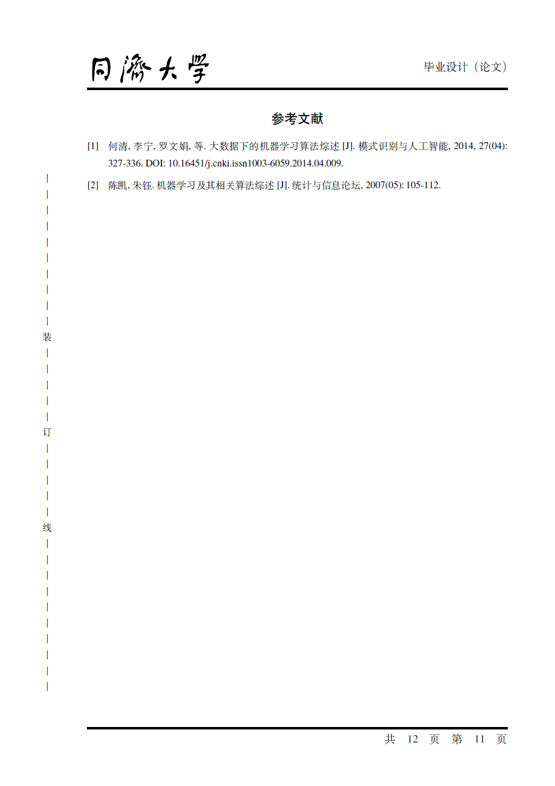
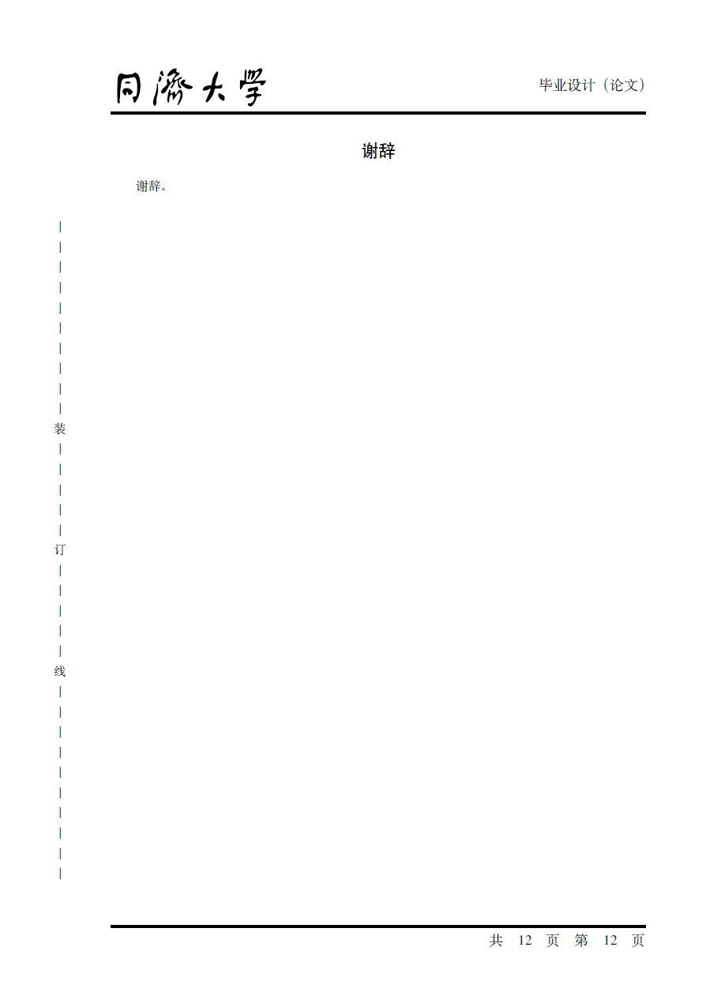

# Tongji University Undergraduate Thesis Template

## 仓库名称

Tongji_University_Undergraduate_Thesis_Template

## 仓库简介

Tongji university undergraduate thesis template (STEM).

同济大学本科毕业设计（论文）模板（理工类）。

## 仓库组成

* `/assets`
模板展示

* `/bib`
参考文献

* `/figures`
图片文件

* `/sections`
章节文件

* `/style`
样式文件

* `main.pdf`
示例 PDF 文档文件

* `main.tex`
主文档文件

* `make.bat`
编译脚本文件

## 模板展示

<p align="center">
  
  
  
  
  
  
  
  
  
</p>

## 编译项目

```
Usage: make [options]

Options:
  - all      Use lualatex to compile the LaTeX document.
  - clean    Clean temporary files.
  - count    Count the number of words in the document.
  - help     Show this help message.

Note: make without any option is equivalent to make all.
```

## 致谢

This repository is a [project](https://github.com/TJ-CSCCG/tongji-undergrad-thesis) originally created by [TJ-CSCCG](http://github.com/TJ-CSCCG). We would like to express our gratitude to [them](https://github.com/TJ-CSCCG/tongji-undergrad-thesis/graphs/contributors) for their contributions and efforts.

这个仓库最初是由 [TJ-CSCCG](http://github.com/TJ-CSCCG) 创建的[项目](https://github.com/TJ-CSCCG/tongji-undergrad-thesis)。我们要感谢[他们](https://github.com/TJ-CSCCG/tongji-undergrad-thesis/graphs/contributors)对同济大学本科毕业设计（论文）模板（理工类）的贡献。

## 文档更新日期

2024年11月11日